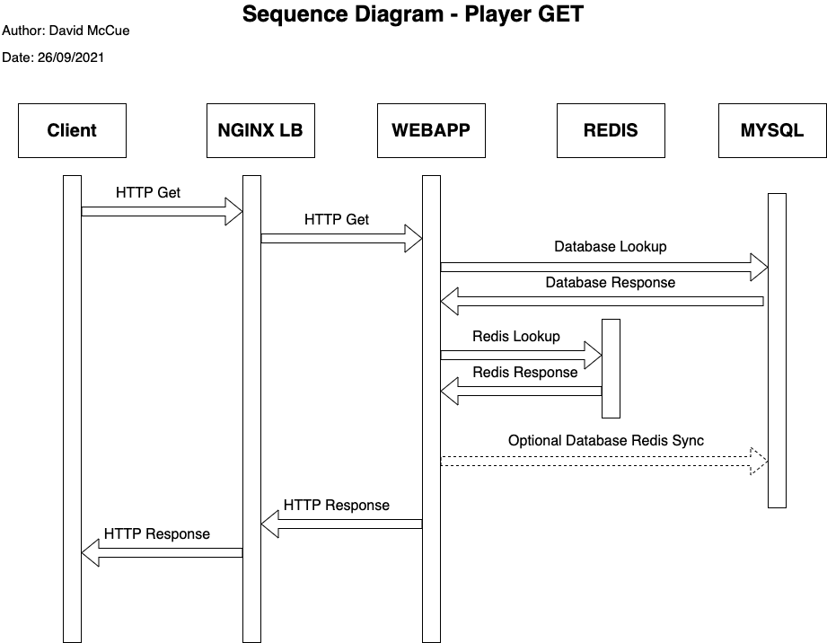
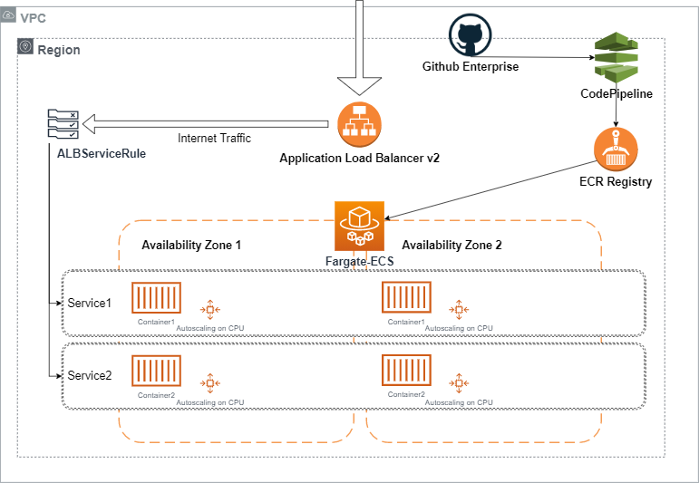

# gamesample

## Introduction

The application contained in this repository consists of an nginx loadbalancer container, one or more web application containers, a redis container and a mysql container.

## Container descriptions

### Nginx loadbalancer container (NGINXLB)
Purpose: This container provides a frontend interface for webtraffic.  The nginx proxy will forward the request on tcp port 8083 to the internal inteface of the web application container on port 5000.  The nginx loadbalancer will query DNS records in a round-robin mechanism to resolve the alias of 'webapp' set by docker-compose to an internal IP of one of the webapp containers. nginx listens internally on tcp port 4000 and is directed to port 8083 externally by docker which then presents the port to the host operating system on localhost:8083.

### Web Application container (WEBAPP)
Purpose: This container hosts the python flask application on port 5000.  It will retrieve environment variables passed from the start.sh script to docker-compose relating to MySQL and Redis authentication details.  After creating a connection to these services it will listen on port 5000 to incoming traffic and respond depending on the endpoint url.  This is currently /player/create or /player/get.  In the event of there being a mismatch between redis and mysql in relation to gold, the app will update mysql with a syncronisation update which could be done asyncronously.

### Redis container (REDIS)
Purpose: Redis is an in-memory cache and can be used to store and update frequently used data.  The reason to use redis over mysql is to optimise latency when looking up specific records rather than request the lookup via a relational database.  The redis container allows for TTL of records and so infreqently used data can be purged from memory increasing accuracy.

### MySQL container (MYSQL)
Purpose: MySQL is a relational database which stores information relating to the player such as player name and player gold.  When a player is created a row is created in the gamesample database and player table to store for future lookups.  The gold is initially set to 0 but can be updated via the webapp.

## Installation/Usage

To install this sample application please follow the instructions below:

Ensure that docker is running and docker-compose 2.0 are installed
```bash
git clone https://github.com/dmccue/gamesample.git && cd gamesample
```

### Starting
To run the stack please run:
```bash
bash start.sh <number of webapp containers>
```
Wait for the stack to create and display output from the nginxlb and webapp containers

### Testing
In an alternative window type:
```bash
bash test.sh
```
You should see the responses to curl commands displayed in the terminal

### Stopping
In an alternative window type:
```bash
bash stop.sh
```

## Future improvements

### AWS Architecture - Using API only


### AWS Architecture - Using static webpages


### AWS Architecture - FARGATE


### AWS Architecture - Lambda


### AWS Architecture - CodePipeline
